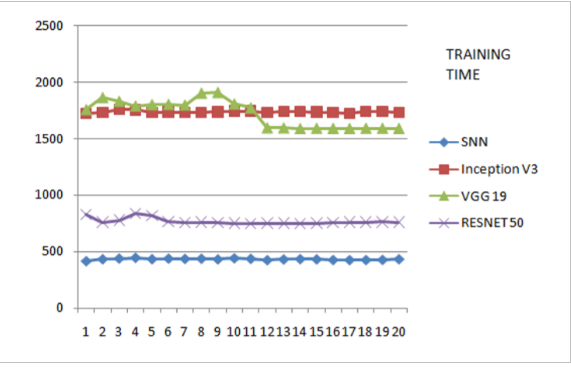
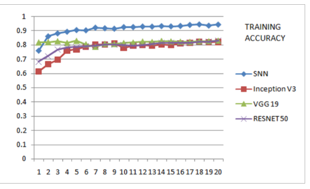
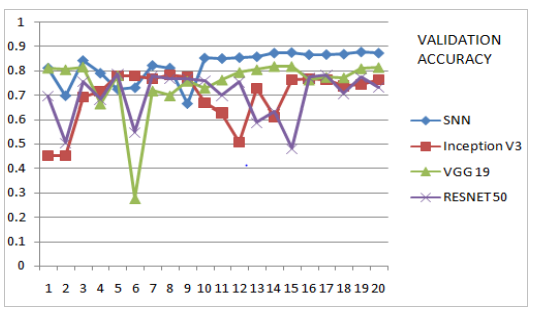
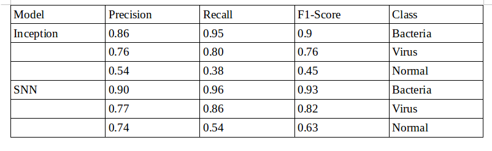

# Medical Diagnosis of Malaria and Pneumonia using SNN

Self Normalizing Neural Networks are used for diagnosing malaria and pneumonia and compared with the ResNet and Inception performance.
SNN performs almost better than Inception and ResNet, with very low computing time at low learning rate for malaria and pneumonia.
SNN outperformed Inception and ResNet at a higher learning rate for pneumonia. 

The dataset is publically available in https://www.kaggle.com/paultimothymooney/chest-xray-pneumonia

## Time taken by different models for training pneumonia

SNN model is able to train faster than other models, because it's capable of training with images of smaller size, thus the number of convolutions operations to be performed is less, speeding the training process. 

x axis represents epochs and y axis presents training time in seconds

## Training accuracy of different models for pneumonia

x axis represents epochs and y axis presents training time in seconds

## Validation accuracy of different models for pneumonia

x axis represents epochs and y axis presents training time in seconds

## Inception vs SNN with initial learning rate = 1e-2

